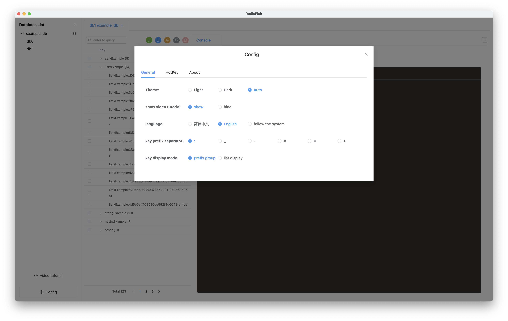

<h3 align="center">RedisFish</h3>

  
  
  

## 介绍

`RedisFish`是一款便捷、跨平台、专注于数据的Redis GUI客户端🌈🌈🌈。或许你会喜欢～

自从`v 1.0.0`后，收到不少小伙伴儿很有用的反馈，非常感谢！

> 原RedFish，由于重名而改名

语言: 简体中文 [English](https://github.com/Kuari/RedisFish)

下载: [releases](https://github.com/Kuari/RedisFish/releases)

## 功能

* redis基础类型数据处理
* 通过颜色区别数据处理的状态，如hash类型的数据中，蓝色代表新增数据，黄色代表编辑过的数据等
* 数据多选处理
* 表格内数据直接`双击`编辑，也可通过`鼠标右击`快捷键放大编辑
* JSON自动格式化
* JSON查看和编辑
* key列表分页查询
* key列表可以通过前缀分组筛选，支持`:`、`-`、`_`、`#`、`=`、`+`分割，在设置中选择
* key列表支持两种不同模式：列表直接展示和根据前缀分类成文件夹展示，在设置中切换
* console支持两种不同模式：单条命令执行和多命令同时执行
* 支持日志功能，查看执行命令日志
* 数据库监控，支持cpu占用率、内存使用量、已连接客户端数、等待阻塞命令客户端数
* 发布/订阅功能图形化操作
* TLS
* 暗黑模式
* 多语言支持，支持中文、英文，根据系统自动切换
* 自动更新（目前仅限MAC和Linux端）

## 快捷键

* **复制**: `Command/Ctrl` + `鼠标左击`点击数据复制
* **Data Zoom**: `鼠标右击`数据，打开Data Zoom，包括文本和json两种模式，可以自动识别

## 视频教程

* [bilibili](https://www.bilibili.com/video/BV1Wf4y1d7JZ?share_source=copy_web)

## 截图

