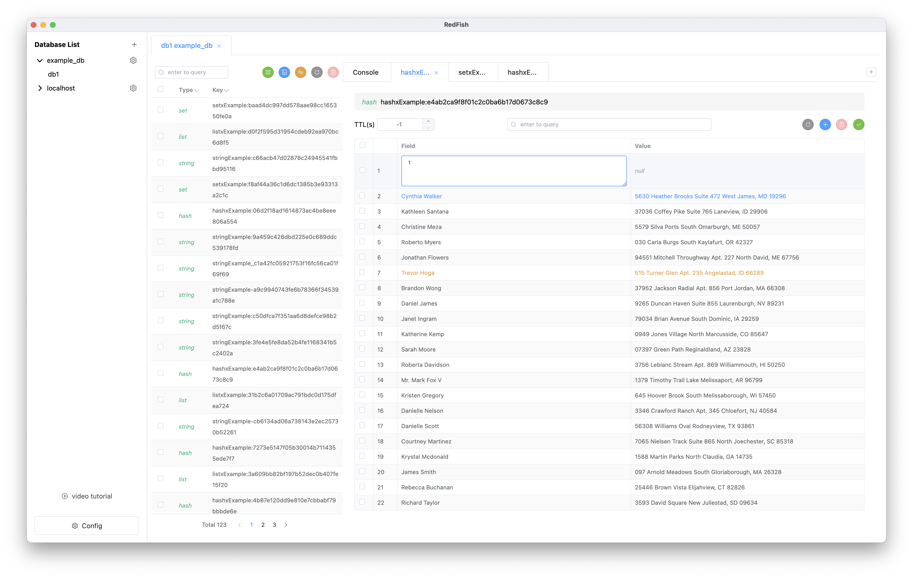
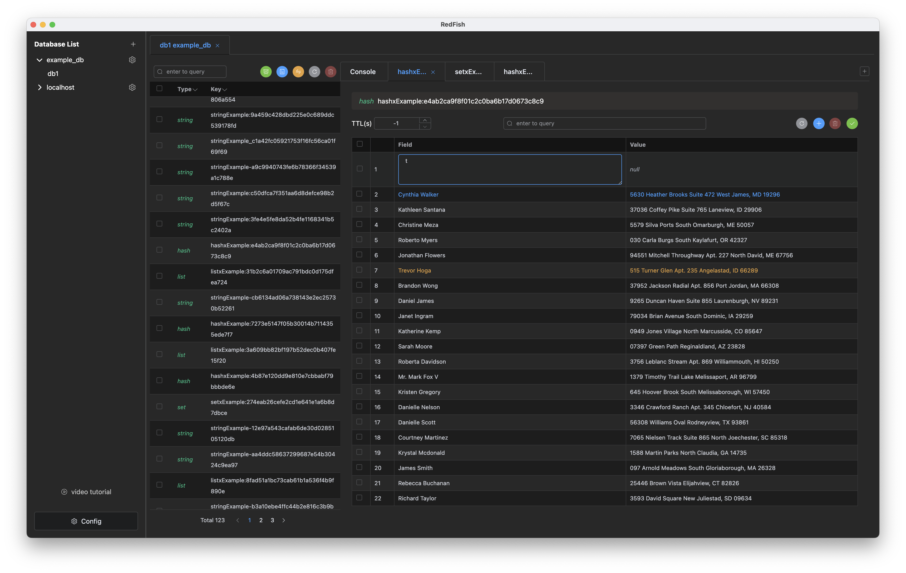
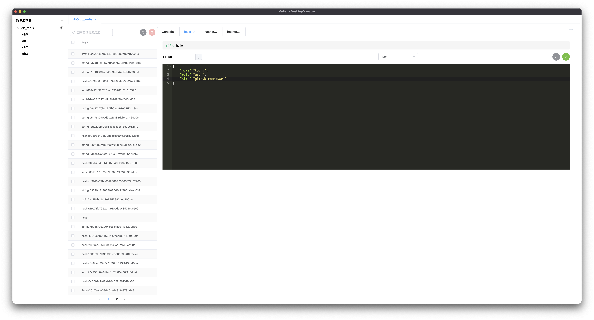
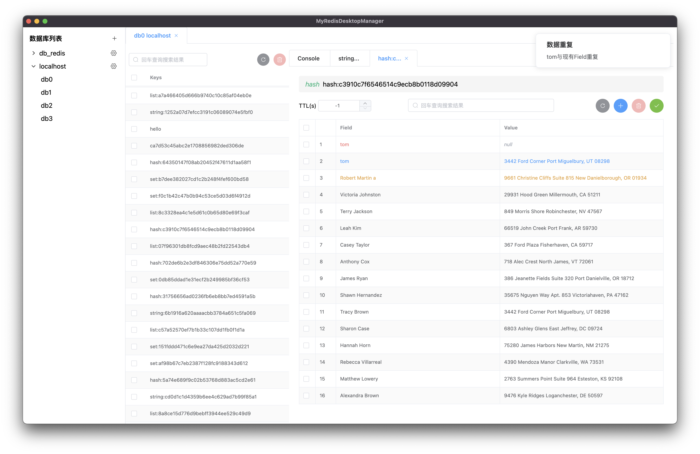
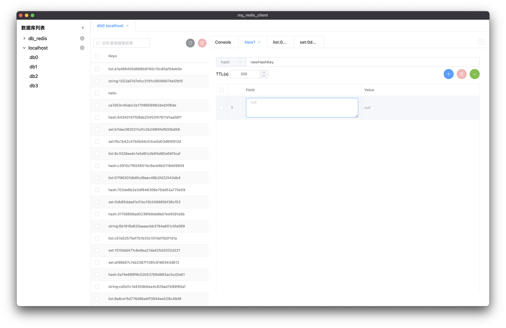
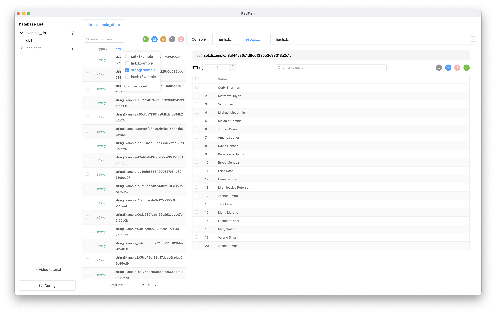

RedFish

## 介绍

`RedFish`是一款便捷、跨平台、专注于数据的Redis GUI客户端。我尽可能地将一些（自认为）奇妙的想法加进去，比如右击放大数据且可编辑功能，也听取了更加资深开发的建议，将其改进。自从`Beta 1.0.0`之后，经过几个月的断断续续的开发，优化了不少地方，甚至有的功能包括不同的处理方式，可以适应不同的操作习惯，希望能够带来更好的体验。感谢每一位使用者，如果有什么反馈，希望你能告诉我。

语言: 简体中文 [英文](https://github.com/Kuari/RedFish)

下载: [releases](https://github.com/Kuari/RedFish/releases)

## 功能

* redis基础类型数据处理
* 通过颜色区别数据处理的状态，如hash类型的数据中，蓝色代表新增数据，黄色代表编辑过的数据等
* 数据多选处理
* 表格内数据直接双击编辑，也可通过`鼠标右击`快捷键放大编辑
* JSON自动格式化
* JSON查看和编辑
* key列表分页查询
* key列表可以通过前缀分组筛选
* console支持两种不同模式：单条命令执行和多命令同时执行
* 支持日志功能，查看执行命令日志
* 数据库监控，支持cpu占用率、内存使用量、已连接客户端数、等待阻塞命令客户端数
* 发布/订阅功能图形化操作
* TLS
* 暗黑模式
* `Command/Windows + 鼠标左击`快捷键复制
* `鼠标右击`数据，打开数据放大编辑器，包括文本和json两种模式
* 多语言支持，支持中文、英文，根据系统自动切换
* 自动更新（目前仅限mac端）

## 截图

